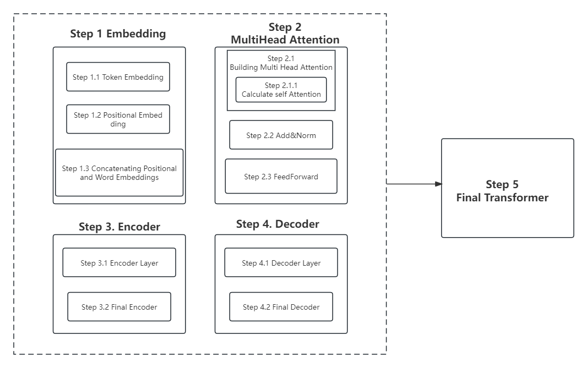

# Transformer code: Step-by-step Understanding

   After reading the article “Solving Transformer by Hand: A Step-by-Step Math Example,” I have gained a deeper understanding of the transformer. Unfortunately, the article does not provide specific code examples for each step. Therefore, this article, based on the aforementioned article, offers code examples and explanations for each part. It is strongly recommended to read this article together with “Solving Transformer by Hand: A Step-by-Step Math Example.”

  I plan to use concise language and detailed code explanations to provide a comprehensive code guide (for both coders and non-coders) with a step-by-step approach to understanding how they work.

 The following is an overall structure diagram of the code, including each step and its respective sub-modules.



## Table of Contents

[TOC]

## Step 1. Embedding

### Step 1.1 Token Embedding

The first step is Token Embedding, where each word is represented by a vector. Code is relatively simple, using the existing Embedding module in torch.

``` python
# step 1.1 The first step is Token Embedding, which is word vector encoding.

import torch
import torch.nn as nn

class TokenEmbedding(nn.Module):
    """
    Token Embedding represents each word as a vector
    
    input size: [batch_size, seq_length]
    return size: [batch_size, seq_length, dim_vector]

    Args:
        vocab_size: size of vocabulary,the vocabulary size determines the total number of unique words in our dataset.
        dim_vector: the dimension of embedding vector for each input word.
    """

    def __init__(self, vocab_size, dim_vector):
        super().__init__()
        self.token_embed = nn.Embedding(vocab_size, dim_vector)

    def forward(self, x):
        return self.token_embed(x)
```

 Typically, our starting input matrix has a size of [batch_size, seq_length], where each word is represented as a vector after token embedding. The output size then changes to [batch_size, seq_length, dim_vector].

### Step 1.2  Positional Embedding

Now we proceed to the second step1.2, which involves adding positional encoding to the input after token embedding. 

We use two formulas from the paper to calculate this. The input here is the same as in the previous step, with a size of [batch_size, seq_length], and the PE matrix represents all the positional information. The final output size is [seq_length, dim_vector]. The detailed code is as follows;

```python
# step 1.2 Positional embeddings for our input
import torch
from torch import nn
import math


class PositionalEmbedding(nn.Module):
    """
        Use the two formulas in the paper to calculate PositionalEmbedding

        input size: [batch_size, seq_length]
        return size: [batch_size, seq_length, dim_vector]

        Args:
            max_len: Maximum length of input sentence
            dim_vector: the dimension of embedding vector for each input word.
    """

    def __init__(self, dim_vector, max_len):
        super().__init__()

        self.dim_vector = dim_vector
        self.max_len = max_len

        pe = torch.zeros(max_len, dim_vector)
        for pos in range(max_len):
            for i in range(0, dim_vector, 2):
                pe[pos, i] = math.sin(pos / (10000 ** ((2 * i) / dim_vector)))
                pe[pos, i + 1] = math.cos(pos / (10000 ** ((2 * i) / dim_vector)))

        # The size of the pe matrix is [max_len, dim_vector].
        print(f"pe size：{pe.size()}")

        # Register buffer, indicating that this parameter is not updated. Tips: Registering the buffer is equivalent
        # to defining self.pe in__init__, so self.pe can be called in the forward function below, but the parameters
        # will not be updated.
        self.register_buffer('pe', pe)

    def forward(self, x):
        # The input x to the position code is [batch_size, seq_len], where seq_len is the length of the sentence
        batch_size, seq_len = x.size()
        # Returns location information for the number of previous seq_len
        return self.pe[:seq_len, :]
```


### Step 1.3  Concatenating Positional and Word Embeddings

We add the word embeddings and positional embeddings together and incorporate a dropout layer to prevent overfitting. 

```python
# step 1.3  Concatenating Positional and Word Embeddings

import torch
import torch.nn as nn
from MyTransformer_English.s1_Embedding.PositionalEmbedding import PositionalEmbedding
from MyTransformer_English.s1_Embedding.TokenEmbedding import TokenEmbedding


class TransformerEmbedding(nn.Module):
    """
            Concatenating Positional and Word Embeddings

            input size: [batch_size, seq_length]
            return size: [batch_size, seq_length, dim_vector]

            Args:
                max_len: Maximum length of input sentence
                dim_vector: the dimension of embedding vector for each input word.
                vocab_size: size of vocabulary,the vocabulary size determines the total number of unique words in our dataset.
                drop_out: probability of an element to be zeroed.
    """
    def __init__(self, vocab_size, dim_vector, max_len, drop_out):
        super().__init__()
        self.token_embd = TokenEmbedding(vocab_size, dim_vector)
        self.position_embd = PositionalEmbedding(dim_vector, max_len)
        self.dropout = nn.Dropout(drop_out)

    def forward(self, x):
        # input
        batch_size, seq_len = x.size()
        token_embd = self.token_embd(x)  # output size: [batch_size, seq_len, dim_vector]
        position_embd = self.position_embd(x)  # output size: [seq_len, dim_vector]
        return self.dropout(token_embd + position_embd)
```

## Step 2. Multi-Head-Attention

### Step 2.1 Building Multi Head Attention

We construct the Multi-Head Attention mechanism. The input is the matrix obtained by adding the token embedding and positional embedding from the previous step, where both the queries (q), keys (k), and values (v) are derived from this matrix, with a size of [batch_size, seq_length, dim_vector].

This step requires the dimensions of dim_vector and the number of heads. The implementation of multi-head attention splits the dim_vector into dim_vector/heads, creating multiple heads where each head has a dimension of dim_split. For instance, if our dimension is 512 and we divide it into 8 heads, then each dim_split would be 512/8 = 64.

Here is the specific code:

```python
# step 2.1 Build multi-head attention layer

import torch.nn as nn
from MyTransformer_English.s1_Embedding.TransformerEmbedding import TransformerEmbedding
from MyTransformer.AllLayers.calculate_attention import calculate_attention
import torch


# The input now accepted is token embedding + position embedding.
# Size: [batch_size, seq_len, dim_vector]

class MultiHeadAttention(nn.Module):
    # n_head即多头，其原理是将dim_vector分割为n_head个。
    """
        Build multi-head attention layer

        input q, k, v size:[batch_size, seq_length, dim_vector]
        return size: [batch_size, seq_length, dim_vector]

        Args:
            dim_vector: the dimension of embedding vector for each input word.
            n_head: Number of heads
    """
    def __init__(self, dim_vector, n_head):
        super().__init__()
        self.n_head = n_head

        # The linear layer in torch is a linear transformation of the input, which will have a Weights parameter
        # matrix, which is learnable. It is also because of this matrix that the Linear layer can change the input
        # in_features into out_features.
        self.w_q = nn.Linear(dim_vector, dim_vector)   # w_q size: [dim_vector, dim_vector]
        self.w_k = nn.Linear(dim_vector, dim_vector)
        self.w_v = nn.Linear(dim_vector, dim_vector)
        self.linear = nn.Linear(dim_vector, dim_vector)

    def forward(self, q, k, v, mask=None):
        # 1、Input q k v(token embedding + position embedding),and then get the true q k v through the linear layer
        q, k, v = self.w_q(q), self.w_k(k), self.w_v(v)

        # 2、dim split
        q, k, v = self.dim_head_split(q), self.dim_head_split(k), self.dim_head_split(v)

        # 3、calculate attention
        out, attention = calculate_attention(q, k, v, mask)  # out size: [batch_size, n_head, seq_len, dim_split]

        # 4、Concat the results
        batch_size, n_head, seq_len, dim_split = out.size()
        dim_vector = n_head * dim_split

        out = out.transpose(1, 2).contiguous().view(batch_size, seq_len, dim_vector) # out size: [batch_size, seq_len, dim_vector]

        # 5、Finally, multiply by a linear layer
        out = self.linear(out)

        # 6、 Attention matrix can be used to visualize attention if needed
        # attention.....

        return out

    def dim_head_split(self, tensor):
        """
        Divide q k v into specified n_head heads in dim_vector dimension

        tensor size: [batch_size, seq_len, dim_vector]
        return size:  [batch_size, n_head, seq_len, dim_split]
        """
        batch_size, seq_len, dim_vector = tensor.size()
        dim_split = dim_vector // self.n_head

        # After splitting, our goal is to get the dimensions in the above return. If we use view directly,
        # although the dimensions are the same, the numbers in the operation are changed.
        tensor = tensor.view(batch_size, seq_len, self.n_head, dim_split)
        # After dimensional segmentation, transpose to match our data composition format
        tensor = tensor.transpose(1, 2)

        return tensor

```

The `calculate_attention` function is implemented as our Step 2.1.1

#### Step 2.1.1 calculate self-attention

Here is the  code:

```python
# Build a sub-part of the multi-head attention layer, i.e., an implementation module for attention calculation

import math
import torch
import torch.nn.functional as F


def calculate_attention(q, k, v, mask=None, drop_out=None):
    """
        calculate self attention

        input q, k, v size:[batch_size, n_head, seq_length, dim_split]
        return size: [batch_size, n_head, seq_length, dim_split]

        Args:
            q: query
            k: key
            v: value
            drop_out: probability of an element to be zeroed.
            mask: mask
    """
    # The input is a four-dimensional matrix
    batch_size, n_head, seq_len, dim_split = q.size()

    # 1、calculate
    k_t = k.transpose(2, 3)
    attention = torch.matmul(q, k_t) / math.sqrt(dim_split)

    # 2、whether to mask
    if mask is not None:
        attention = attention.masked_fill(mask == 0, -10000)

    # 3、 Do softmax ,so parameters are in the range 0-1
    attention = F.softmax(attention, dim=-1)
    if drop_out is not None:
        attention = F.dropout(attention, drop_out)

    # 4、Multiply the result by V
    out = torch.matmul(attention, v)
    return out, attention
```

### Step 2.2 Add&Norm

In this layer, the “Add” operation serves as the residual block, which will be implemented in the subsequent model. For this code, only the Norm layer is implemented.

The Norm layer has been implemented in PyTorch, and we can simply use nn.LayerNorm. However, in this layer, we still implement it ourselves to reinforce our understanding. In the subsequent model, we will not use the MyAddNorm from this layer but will directly use nn.LayerNorm.

```python
# step 2.2、Add&Norm. In fact,add here is actually residual block.
# This part actually only implements Norm, the residual block needs to be implemented later.
import torch
import torch.nn as nn


# The following is the implementation of the Norm layer, in fact, there is already an implementation in pytorch,
# we just need to call nn. LayerNorm. So I won't be using MyAddNorm later
class MyAddNorm(nn.Module):
    def __init__(self, dim_vector, error=1e-12):
        super().__init__()
        self.gamma = nn.Parameter(torch.ones(dim_vector))
        self.beta = nn.Parameter(torch.zeros(dim_vector))
        self.error = error

    def forward(self, x):
        mean = x.mean(-1, keepdim=True)
        var = x.var(-1, unbiased=False, keepdim=True)
        out = (x - mean) / torch.sqrt(var + self.eps)
        out = self.gamma * out + self.beta
        return out
```

### Step 2.3 FeedForward

A very simple structure, a combination of Linear and Relu.

```python
# step 2.3 FeedForward，A very simple structure, a combination of Linear and Relu
# FFN(x) = max(0, xW1 + b1)W2 + b2
import torch.nn as nn


class FeedForward(nn.Module):
    def __init__(self, dim_vector, dim_hidden, dropout=0.1):
        super().__init__()
        self.feedforward = nn.Sequential(
            nn.Linear(dim_vector, dim_hidden),
            nn.ReLU(),
            nn.Dropout(dropout),
            nn.Linear(dim_hidden, dim_vector)
        )

    def forward(self, x):
        out = self.feedforward(x)
        return out
```

## Step 3. Encoder

### Step 3.1 Encoder Layer

The modules have been written before, and now they need to be assembled to form the encoder layer.

```python
# step 3.1、The modules have been written before, and now they need to be assembled to form the encoder layer.
import torch.nn as nn
from MyTransformer_English.s2_MultiHeadAttention.muti_head_attention import MultiHeadAttention
from MyTransformer_English.s2_MultiHeadAttention.feed_forward import FeedForward


class EncoderLayer(nn.Module):
    """
        Encoder Layer

        input size:[batch_size, seq_length, dim_vector]
        return size: [batch_size, seq_length, dim_vector]

        Args:
            dim_vector: the dimension of embedding vector for each input word.
            n_head: Number of heads
            dim_hidden: The parameter in the feedforward layer
            dropout: probability of an element to be zeroed.
    """
    def __init__(self, dim_vector, n_head, dim_hidden, dropout):
        super().__init__()
        self.attention = MultiHeadAttention(dim_vector, n_head)
        self.norm1 = nn.LayerNorm(dim_vector)
        self.dropout1 = nn.Dropout(dropout)

        self.feedforward = FeedForward(dim_vector, dim_hidden, dropout)
        self.norm2 = nn.LayerNorm(dim_vector)
        self.dropout2 = nn.Dropout(dropout)

    def forward(self, x, src_mask):
        # 1、 calculate multi-head-attention
        out = self.attention(q=x, k=x, v=x, mask=src_mask)

        # 2、 Add and Norm
        out = self.dropout1(out)
        out = self.norm1(x + out)

        # 3、 FeedForward
        _x = out
        out = self.feedforward(out)

        # 4、Add and Norm
        out = self.dropout2(out)
        out = self.norm2(out + _x)
        return out
```


### Step 3.2 Final Encoder

The final Encoder part, including Embedding and encoder_layer.

```python
# step 3.2 The final Encoder part, including Embedding and encoder_layer
import torch.nn as nn
import torch
from MyTransformer_English.s1_Embedding.TransformerEmbedding import TransformerEmbedding
from MyTransformer_English.s3_Encoder.encoder_layer import EncoderLayer


class Encoder(nn.Module):
    """
        Final Encoder Layer

        input size:[batch_size, seq_length, dim_vector]
        return size: [batch_size, seq_length, dim_vector]

        Args:
            vocab_size: size of vocabulary,the vocabulary size determines the total number of unique words in our dataset.
            dim_vector: the dimension of embedding vector for each input word.
            n_head: Number of heads
            max_len: Maximum length of input sentence
            dim_hidden: The parameter in the feedforward layer
            drop_out: probability of an element to be zeroed.
            num_layer: The number of encoders
    """
    def __init__(self, vocab_size, dim_vector, max_len, drop_out, num_layer, n_head, dim_hidden):
        super().__init__()
        self.embed = TransformerEmbedding(vocab_size, dim_vector, max_len, drop_out)
        self.encoder_layers = nn.ModuleList(
            [EncoderLayer(dim_vector, n_head, dim_hidden, drop_out) for _ in range(num_layer)])

    def forward(self, x, src_mask):
        x = self.embed(x)
        for layer in self.encoder_layers:
            x = layer(x, src_mask)
        return x
```


## Step 4. Decoder

### Step 4.1 Decoder Layer

In "encoder-decoder attention" layers, the q come from the previous decoder layer, and the k and v come from the output of the encoder.

```python
# step 4.1、encoder layer
import torch.nn as nn
from MyTransformer_English.s2_MultiHeadAttention.muti_head_attention import MultiHeadAttention
from MyTransformer_English.s2_MultiHeadAttention.feed_forward import FeedForward


class DecoderLayer(nn.Module):
    """
        Decoder Layer

        Args:
            dim_vector: the dimension of embedding vector for each input word.
            n_head: Number of heads
            dim_hidden: The parameter in the feedforward layer
            dropout: probability of an element to be zeroed.
    """
    def __init__(self, dim_vector, n_head, dropout, dim_hidden):
        super().__init__()
        # 1、The first attention layer and add&norm in decoder
        self.attention_1 = MultiHeadAttention(dim_vector, n_head)
        self.norm1 = nn.LayerNorm(dim_vector)
        self.dropout1 = nn.Dropout(dropout)

        # 2、 The second attention layer and add&norm in decoder
        self.attention_2 = MultiHeadAttention(dim_vector, n_head)
        self.norm2 = nn.LayerNorm(dim_vector)
        self.dropout2 = nn.Dropout(dropout)

        # 3、Feedforward and add&norm
        self.feedforward = FeedForward(dim_vector, dim_hidden, dropout)
        self.norm2 = nn.LayerNorm(dim_vector)
        self.dropout3 = nn.Dropout(dropout)

    def forward(self, encoder_output, decoder_input, trg_mask, src_mask):
        """
            Decoder Layer

            Args:
                encoder_output: Output of encoder layer
                decoder_input: Input of decoder layer
                trg_mask: Target mask, in decoder layer, this is the first mask
                src_mask: The second mask in decoder layer
        """
        # 1、The first attention layer
        _input = decoder_input
        x = self.attention_1(q=decoder_input, k=decoder_input, v=decoder_input, mask=trg_mask)

        # 2、 Add&Norm
        x = self.dropout1(x)
        x = self.norm1(x + _input)

        # 3、The second attention layer
        _input = x
        x = self.attention_2(q=x, k=encoder_output, v=encoder_output, mask=src_mask)

        # 4、 Add&Norm
        x = self.dropout2(x)
        x = self.norm1(x + _input)

        # 5、feedforward
        _input = x
        x = self.feedforward(x)

        # 6、 Add&Norm
        x = self.dropout3(x)
        x = self.norm1(x + _input)
        return x
```


### Step 4.2 Final Decoder

The final Decoder part, including Embedding and decoder_layer

```
# step 4.2 The final Decoder part, including Embedding and decoder_layer
import torch.nn as nn
from MyTransformer_English.s1_Embedding.TransformerEmbedding import TransformerEmbedding
from MyTransformer_English.s4_Decoder.decoder_layer import DecoderLayer


class Decoder(nn.Module):
    """
        Final Decoder Layer

        input size:[batch_size, seq_length, dim_vector]
        return size: [batch_size, seq_length, vocab_size]

        Args:
            vocab_size: size of vocabulary,the vocabulary size determines the total number of unique words in our dataset.
            dim_vector: the dimension of embedding vector for each input word.
            n_head: Number of heads
            max_len: Maximum length of input sentence
            dim_hidden: The parameter in the feedforward layer
            dropout: probability of an element to be zeroed.
            num_layer: The number of encoders
    """
    def __init__(self, vocab_size, dim_vector, max_len, dropout, num_layer, n_head, dim_hidden):
        super().__init__()
        self.embed = TransformerEmbedding(vocab_size, dim_vector, max_len, dropout)
        self.decoder_layers = nn.ModuleList(
            [DecoderLayer(dim_vector, n_head, dropout, dim_hidden) for _ in range(num_layer)])
        self.linear = nn.Linear(dim_vector, vocab_size)
        
    def forward(self, decoder_input, encoder_output, trg_mask, src_mask):
        # 1、 embedding
        out = self.embed(decoder_input)

        # 2、attention
        for layer in self.decoder_layers:
            out = layer(encoder_output, out, trg_mask, src_mask)

        # 3、 linear
        out = self.linear(out)
        return out
```


## Step 5. Final Transformer

After a series of preparations, we can finally construct the last Transformer model. The code is as follows, and we conducted a test at the end, which successfully produced the output.

```
# step 5 Final Transformer
# The implementation of src_mask and trg_mask is also covered here.
import torch.nn as nn
import torch
from MyTransformer_English.s3_Encoder.final_encoder import Encoder
from MyTransformer_English.s4_Decoder.final_decoder import Decoder


class Transformer(nn.Module):
    """
        Final Transformer

        Args:
            encoder_voc_size: size of encoder vocabulary,the vocabulary size determines the total number of unique words in our dataset.
            decoder_voc_size: size of decoder vocabulary,the vocabulary size determines the total number of unique words in our dataset.
            dim_vector: the dimension of embedding vector for each input word.
            n_head: Number of heads
            max_len: Maximum length of input sentence
            dim_hidden: The parameter in the feedforward layer
            dropout: probability of an element to be zeroed.
            num_layer: The number of encoders
            src_pad_idx: mask idx
            trg_pad_idx: mask idx
    """

    def __init__(self, src_pad_idx, trg_pad_idx, encoder_voc_size, decoder_voc_size, dim_vector, n_head,
                 max_len, dim_hidden, num_layer, dropout):
        super().__init__()
        self.src_pad_idx = src_pad_idx
        self.trg_pad_idx = trg_pad_idx
        self.encoder = Encoder(
            encoder_voc_size, dim_vector, max_len, dropout, num_layer, n_head, dim_hidden
        )
        self.decoder = Decoder(
            decoder_voc_size, dim_vector, max_len, dropout, num_layer, n_head, dim_hidden
        )

    def forward(self, src_input, trg_input):
        src_mask = get_src_mask(src_input, self.src_pad_idx)
        trg_mask = get_trg_mask(trg_input, self.trg_pad_idx)

        encoder_out = self.encoder(src_input, src_mask)
        final_out = self.decoder(trg_input, encoder_out, trg_mask, src_mask)
        return final_out


# This function echoes masked_fill in calculate_attention
def get_src_mask(seq, src_pad_idx):
    return (seq != src_pad_idx).unsqueeze(1).unsqueeze(2)


def get_trg_mask(seq, trg_pad_idx):
    batch_size, seq_len = seq.size()
    trg_pad_mask = (seq != trg_pad_idx).unsqueeze(1).unsqueeze(3)
    trg_sub_mask = torch.tril(torch.ones(seq_len, seq_len)).type(torch.ByteTensor)
    trg_mask = trg_sub_mask & trg_pad_mask
    return trg_mask


# final test
if __name__ == '__main__':
    src_input = torch.LongTensor([[1, 1, 4, 0], [4, 3, 2, 9]])
    trg_input = torch.LongTensor([[5, 2, 5, 0], [6, 7, 9, 8]])
    src_pad_idx = 0
    trg_pad_idx = 0
    encoder_voc_size = 10
    decoder_voc_size = 10
    dim_vector = 6
    n_head = 2
    max_len = 10
    dim_hidden = 3
    num_layer = 9
    dropout = 0.1

    model = Transformer(src_pad_idx, trg_pad_idx, encoder_voc_size, decoder_voc_size, dim_vector, n_head, max_len,
                        dim_hidden,
                        num_layer, dropout)
    out = model(src_input, trg_input)
    print(out)
```


## Update Plan for Future

Although I wish to provide a detailed and comprehensive explanation of the Transformer to ensure that everyone can understand it, this article still has many shortcomings. The next step is to delve into more detailed explanations of certain aspects.

- [ ] Provide a detailed explanation of the masking technique and its application.
- [ ] Conduct input-output tests for each step to help readers better understand how it works.
- [ ] Explain practical tasks based on the Transformer architecture, such as machine translation and text classification.

Look forward to the upcoming content updates. Also, feel free to leave questions and suggestions in the comments section. I will do my best to answer and improve them.